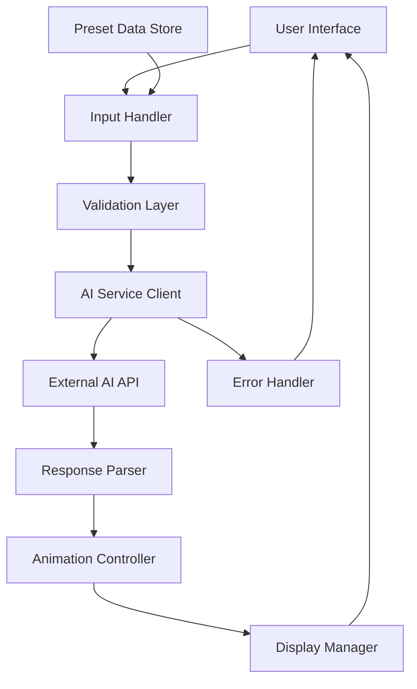
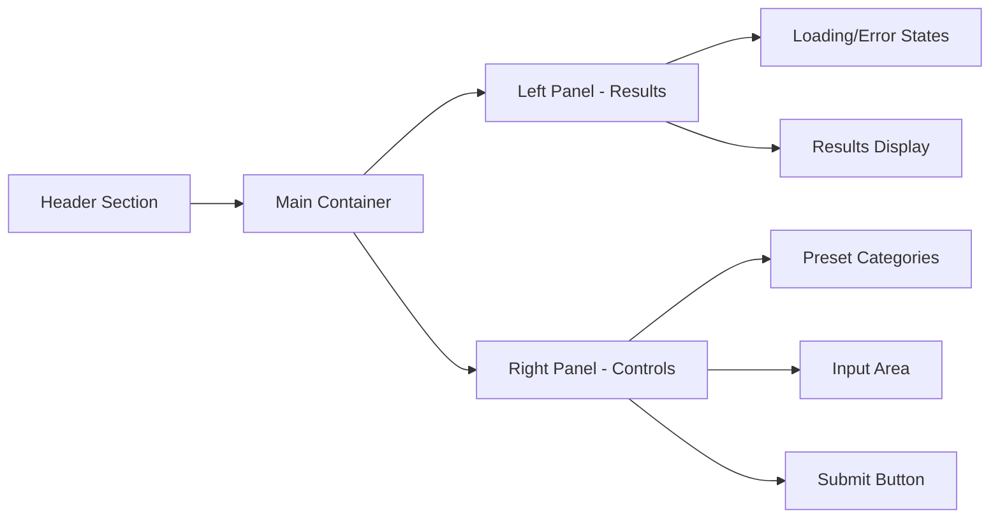

# Design Document

## Overview

The Anti-PUA Debate Bot is a single-page web application that integrates with an AI service to generate counter-arguments for manipulative workplace rhetoric. The system features a dual-panel layout with real-time AI response generation, animated result presentation, and responsive design for cross-platform compatibility.

## Architecture

### System Architecture



### Technology Stack

- **Frontend**: HTML5, CSS3 (Grid/Flexbox), Vanilla JavaScript (ES6+)
- **AI Integration**: OpenAI-compatible API (DeepSeek-V3 model)
- **Styling**: CSS Grid for layout, CSS animations for effects
- **No external frameworks**: Pure web technologies for minimal dependencies

## Components and Interfaces

### Core Components

#### 1. InputHandler Component
- **Purpose**: Manages user input and preset opinion selection
- **Methods**:
  - `handleTextInput(text)`: Validates and processes manual text input
  - `fillSuggestion(presetText)`: Populates input field with preset opinion
  - `handleSubmit()`: Triggers opinion processing workflow
- **Events**: Keyboard shortcuts (Ctrl/Cmd + Enter), button clicks

#### 2. AIServiceClient Component
- **Purpose**: Handles communication with external AI API
- **Configuration**:
  - API Endpoint: `https://api2.aigcbest.top/v1/chat/completions`
  - Model: `DeepSeek-V3`
  - Authentication: Bearer token
- **Methods**:
  - `generateCounterArguments(opinion)`: Sends request to AI service
  - `parseResponse(apiResponse)`: Extracts structured data from AI response
- **Error Handling**: Network timeouts, API errors, malformed responses

#### 3. DisplayManager Component
- **Purpose**: Controls result presentation and animations
- **Methods**:
  - `displayResults(originalOpinion, counterArguments, humor)`: Orchestrates result display
  - `typeWriter(element, text, speed)`: Implements typewriter animation
  - `showLoadingState()`: Displays loading indicators
  - `showErrorState(message)`: Presents error messages

#### 4. PresetDataStore Component
- **Purpose**: Manages categorized preset opinions
- **Categories**:
  - Classic Opinions (Green theme): General life statements
  - Workplace PUA (Orange theme): Manipulative workplace rhetoric
  - Anti-Discipline (Red theme): Exploitative work culture statements
- **Data Structure**: Categorized arrays of preset text strings

### Interface Specifications

#### User Interface Layout



#### API Interface

**Request Format:**
```json
{
  "model": "DeepSeek-V3",
  "messages": [
    {
      "role": "system",
      "content": "You are a witty anti-PUA debate bot..."
    },
    {
      "role": "user",
      "content": "[User's opinion to counter]"
    }
  ],
  "temperature": 0.8,
  "max_tokens": 1000,
  "response_format": { "type": "json_object" }
}
```

**Expected Response Format:**
```json
{
  "counter_opinions": [
    "Counter-argument 1",
    "Counter-argument 2", 
    "Counter-argument 3"
  ],
  "humor_response": "Humorous summary comment"
}
```

## Data Models

### Opinion Input Model
```javascript
class OpinionInput {
  constructor(text, category = null) {
    this.text = text;
    this.category = category; // 'classic', 'workplace', 'anti-discipline'
    this.timestamp = new Date();
    this.isValid = this.validate();
  }
  
  validate() {
    return this.text && this.text.trim().length > 0;
  }
}
```

### AI Response Model
```javascript
class AIResponse {
  constructor(counterOpinions, humorResponse) {
    this.counterOpinions = counterOpinions; // Array of 3 strings
    this.humorResponse = humorResponse;     // Single string
    this.generatedAt = new Date();
  }
  
  isComplete() {
    return this.counterOpinions.length === 3 && this.humorResponse;
  }
}
```

### UI State Model
```javascript
class UIState {
  constructor() {
    this.isLoading = false;
    this.hasError = false;
    this.errorMessage = '';
    this.currentResults = null;
    this.selectedCategory = null;
  }
}
```

## Error Handling

### Error Categories and Responses

1. **Input Validation Errors**
   - Empty input: "Please enter an opinion to counter"
   - Excessive length: "Please keep input under 500 characters"

2. **Network Errors**
   - Connection timeout: "Connection timed out. Please check your internet and try again"
   - API unavailable: "AI service temporarily unavailable. Please try again later"

3. **API Response Errors**
   - Invalid JSON: "Received invalid response from AI service"
   - Missing required fields: "AI response incomplete. Please try again"
   - Rate limiting: "Too many requests. Please wait a moment and try again"

4. **Browser Compatibility Errors**
   - Unsupported features: Graceful degradation with basic functionality

### Error Recovery Strategies

- **Automatic Retry**: Network errors trigger one automatic retry after 2-second delay
- **Fallback Responses**: If AI service fails, show encouraging message to try again
- **State Reset**: Errors automatically clear when user initiates new request
- **User Feedback**: Clear, actionable error messages guide user next steps

## Testing Strategy

### Unit Testing Focus Areas

1. **Input Validation**
   - Empty input handling
   - Special character processing
   - Length limit enforcement

2. **API Integration**
   - Request formatting
   - Response parsing
   - Error handling scenarios

3. **Animation System**
   - Typewriter effect timing
   - Animation interruption handling
   - Performance under rapid interactions

### Integration Testing Scenarios

1. **End-to-End Workflows**
   - Complete opinion submission and response cycle
   - Preset opinion selection and processing
   - Error state recovery

2. **Cross-Browser Compatibility**
   - Layout rendering across target browsers
   - Animation performance consistency
   - Touch interaction on mobile devices

3. **API Integration**
   - Real API communication testing
   - Response format validation
   - Error scenario simulation

### Performance Testing

1. **Response Time Targets**
   - Initial page load: < 3 seconds
   - AI response processing: < 30 seconds
   - Animation completion: < 2 seconds per counter-argument

2. **Resource Usage**
   - Memory usage monitoring during extended sessions
   - Network request optimization
   - CSS animation performance profiling

### User Acceptance Testing

1. **Usability Scenarios**
   - First-time user experience
   - Mobile device interaction patterns
   - Accessibility with screen readers

2. **Content Quality**
   - Counter-argument relevance and quality
   - Humor appropriateness
   - Response diversity across multiple submissions